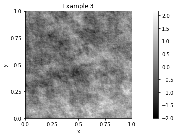
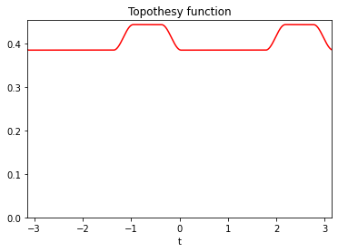
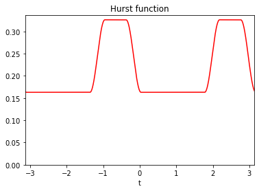

==========
.. sectionauthor:: Frédéric Richard <frederic.richard_at_univ-amu.fr>

PyAFBFdb is supplementary to the package `PyAFBF <https://github.com/fjprichard/PyAFBFdb>`_. The package PyAFBF is devoted to the simulation of rough :term:`anisotropic<isotropy>` textures of images. It is documented on the `github page <https://fjprichard.github.io/PyAFBF/>`_ and in the papers :cite:`Richard2022`, :cite:`Bierme-2015-TBM`. PyAFBFdb enables building and managing database of textures generated from PyAFBF.

A texture example generated with PyAFBF is shown below

Such a texture is sampled from a random field called the **anisotropic fractional Brownian fields**. The probability distribution of this field is characterized by two functions :math:`\tau` and :math:`\beta` , called the **topothesy function** and the **Hurst function**, respectively. These two functions determine the directional properties of the field. They can be represented as smooth step functions as show below.

The PyAFBFdb package enables to generate database formed by 

- a series of field models by sampling the step coefficients of the Hurst and topothesy functions at random,

- a series of texture images by sampling from each field model.  

A typical example of a database includes a field model as given by its Hurst and topothesy functions, and a texture image sampled from the model. 
	   
In addition, an example also includes some texture features related to the Hurst functions:

- the minimal value of the Hurst function, called the Hurst index:

   .. math::
      H = \min_{s, \tau(s)>0} \beta(s). 
- the length of the argmin set of the Hurst function:

   .. math::
   	\mathcal{L}_H = \mathrm{length}\left(\{s \in \left[\frac{-\pi}{2}, \frac{\pi}{2}\right],  \beta(s)=H, \tau(s)>0 \}\right).

- the central orientation :math:`\varphi_H` of the argmin set of the Hurst function.

In the example shown above they are :math:`H = 0.16`, :math:`\mathcal{L}_H = 1.74` and :math:`\varphi_H = 0.91`.

The basics for manipulating the database build by PyAFBFdb are described in the quickstart examples.
